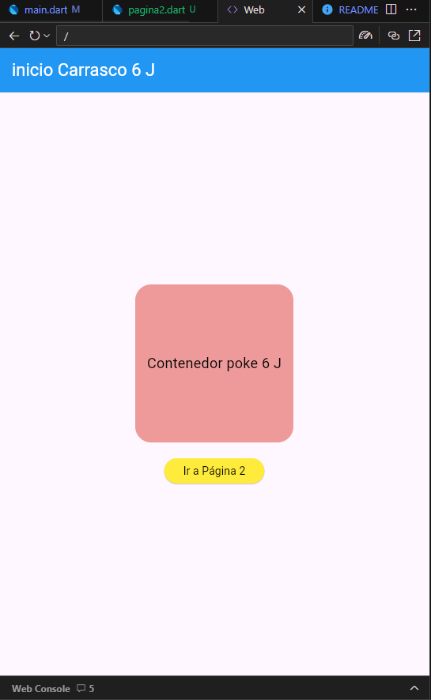
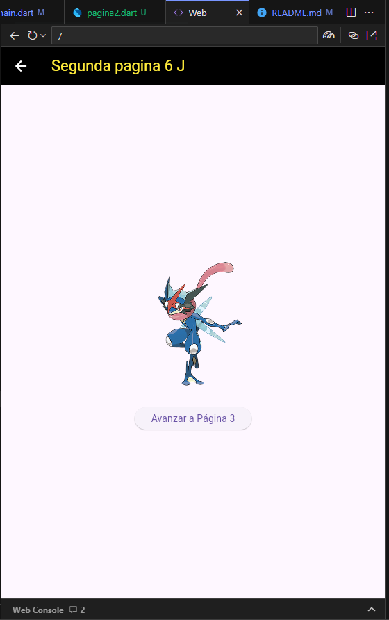
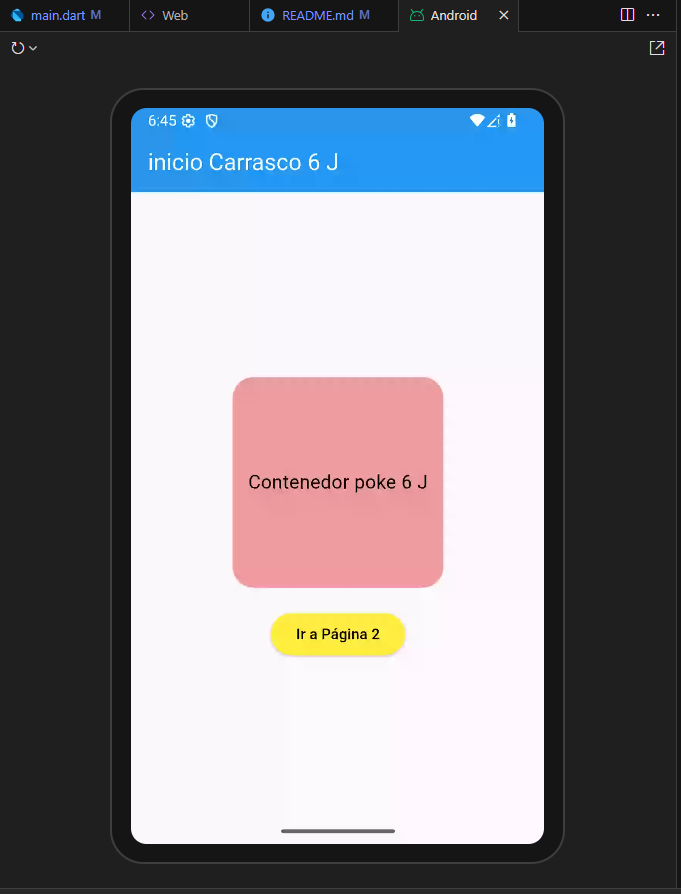
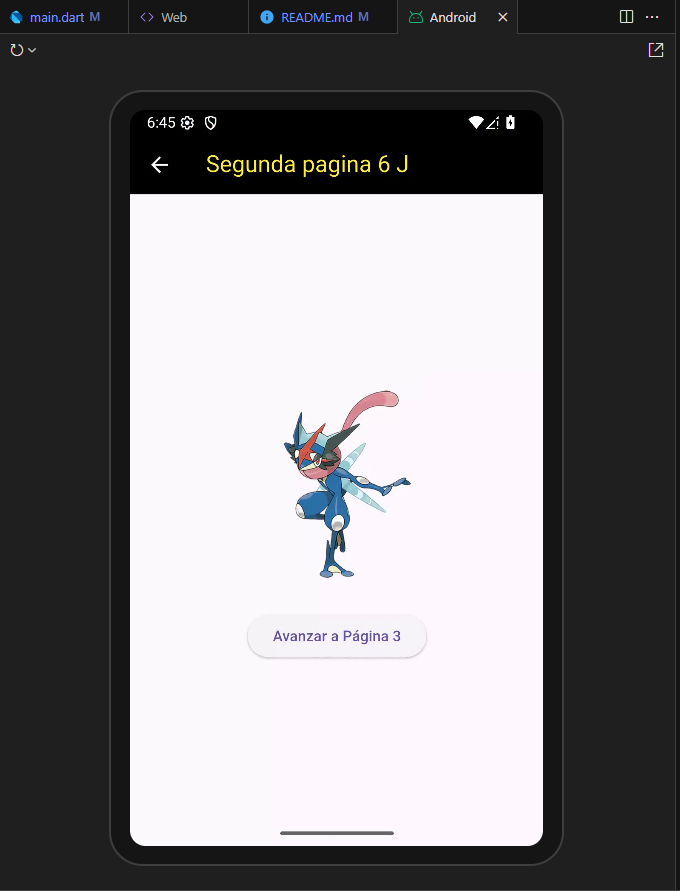

# Navegacion entre paginas flutter
# Gael Carrasco Gpo 6J
# mi prompt o pregunta AI

lenguaje dart flutter, nivel principal, navegación entre 3 paginas utilizando rutas nombradas, desde main llamar a la pagina 1, en la pagina 1 en appbar mostrar el texto "inicio Carrasco 6 J" en color blanco, color de fondo azul, iconos blancos, en body un contenedor redondeado color rojo claro 200 por 200 con texto negro y centrado, y un botón de color amarillo texto negro para seleccionar pagina 2, en pagina 2 un appbar con texto "Segunda pagina 6 J" en amarillo, fondo negro y los iconos en blanco, en body una imagen desde la red y un botón para avanzar a la pagina 3, en la pagina 3 en appbar con texto negro "pagina 3 El Carrasco", color de fondo rojo, todo en un solo archivo  

### 3 pantallas web

### 3 pantallas android

